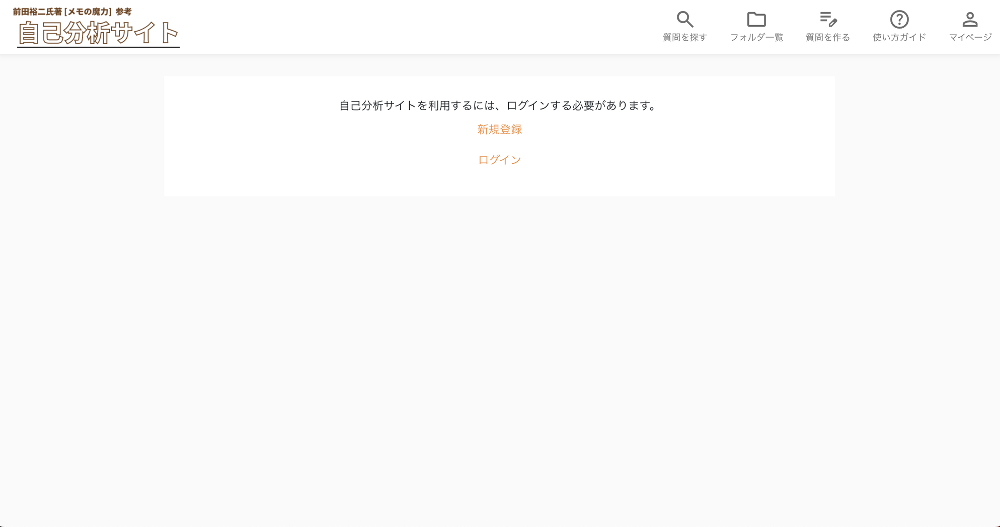

### 概要
前田裕二さんの「メモの魔力」という本を参考に、**自己分析を行って、簡単に振り返る**ことができるアプリを作成しました。

### URL
[https://selfanalysis-memo.com](http://selfanalysis-memo.com/) 
※サンプルユーザーでログインできます

メールアドレス：<strong>morita@sample.com</strong>
 
パスワード：<strong>selfanalysis</strong>

### サービスへの想い
私は就職活動を始めてから、「メモの魔力」という本で自己分析を積極的に行ったことによって、自分の価値観が明確になり、面接でも自分の考えを根拠を持って話せるようになりました。

この感動を皆に伝えたいと思ったものの、手書きが面倒だったり、目的の質問や回答を探して振り返るのが面倒という課題がありました。

そこで、就活生をメインターゲットとして、**より快適に、より効率的に自己分析を行うため**にこのアプリを作成しました。

### 工夫した点
- 上記の課題を解決するために、特に質問の検索・フォルダ機能を重視しています。
- **「メモの魔力」の読者でない方でも使えるように使い方ガイドを設置し、自己分析の方法や活かす方法を紹介しました。**
- 「質問を作る」メニューを用意し、用意された質問だけでなくオリジナルの質問にも回答できるようにしました。

### 使用技術
| カテゴリー | 技術スタック |
| --- | --- |
| フロントエンド | React, TypeScript |
| バックエンド | Django REST Framework |
| データベース | PostgreSQL |
| インフラ | AWS (ECS on EC2), ELB |
| 環境構築 | Docker |

### 画面や機能の説明
- **ログイン、新規登録**
<table>
  <tr>
     <td>
    </td>
    <td>ログイン前</td>
    <td>新規登録</td>
  </tr>
    <tr>
       <td>
    </td>
    <td>
      
    </td>
    <td>
      
    </td>
  </tr>
</table>

- **メニュー一覧**
<table>
  <tr>
    <td>
    </td>
    <td>
      
    </td>
  </tr>
</table>

 - **「質問を探す」メニュー**
<table>
  <tr>
     <td>
    </td>
    <td>質問をフリーワードで検索</td>
    <td>用意された質問・作成した質問から選ぶ</td>
  </tr>
    <tr>
       <td>
    </td>
    <td>
      
    </td>
    <td>
      
    </td>
  </tr>
</table>

 - **質問の詳細(メニューバーにはありません)**
<table>
  <tr>
     <td>
    </td>
    <td>「用意された質問」の質問選択画面</td>
    <td>質問をフォルダに追加</td>
  </tr>
    <tr>
       <td>
    </td>
    <td>
      
    </td>
    <td>
      
    </td>
  </tr>
   <tr>
     <td>
    </td>
    <td>質問に回答する</td>
    <td>これまでの回答を見る</td>
  </tr>
    <tr>
       <td>
    </td>
    <td>
      
    </td>
    <td>
      
    </td>
  </tr>
</table>

 - **「フォルダ一覧」メニュー**
<table>
  <tr>
     <td>
    </td>
    <td></td>
    <td>フォルダ一覧</td>
  </tr>
    <tr>
       <td>
    </td>
    <td>
    </td>
    <td>
      
    </td>
  </tr>
</table>

 - **「質問を作る」メニュー**
<table>
  <tr>
     <td>
    </td>
    <td></td>
    <td>オリジナルの質問を作る</td>
  </tr>
    <tr>
       <td>
    </td>
    <td>
    </td>
    <td>
      
    </td>
  </tr>
</table>

 - **「質問を作る」メニュー**
<table>
  <tr>
     <td>
    </td>
    <td></td>
    <td>オリジナルの質問を作る</td>
  </tr>
    <tr>
       <td>
    </td>
    <td>
    </td>
    <td>
      
    </td>
  </tr>
</table>

 - **「使い方ガイド」メニュー**
<table>
  <tr>
     <td>
    </td>
    <td></td>
    <td>使い方ガイド（このアプリの使い方、自己分析の方法など）</td>
  </tr>
    <tr>
       <td>
    </td>
    <td>
    </td>
    <td>
      
    </td>
  </tr>
</table>

 - **「マイページ」メニュー**
<table>
  <tr>
     <td>
    </td>
    <td></td>
    <td>マイページ</td>
  </tr>
    <tr>
       <td>
    </td>
    <td>
    </td>
    <td>
      
    </td>
  </tr>
</table>

### ER図

### 今後の展望
- 挑戦したい技術など
    - 機能追加に備えてフロントエンドのテストコードを書く
    - CI/CDの設定(GitHub Actionsを想定)
    - セキュリティの強化
- 追加で実装したい機能
    - 回答に対する検索機能
    - パスワード変更機能
    - メール認証機能
    - スマホ用のデザイン